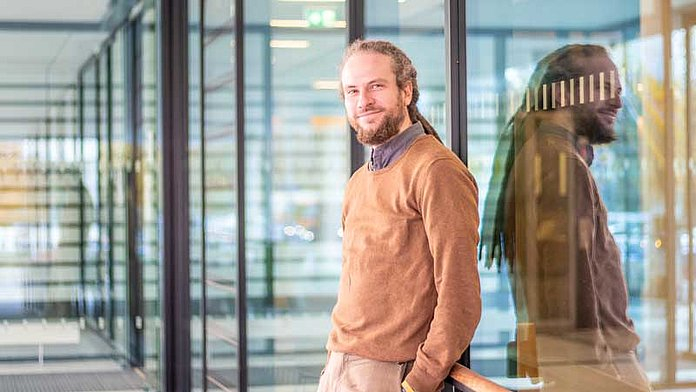

# Robert Haase

<pre>
Dr. rer. medic. Robert Haase

Lecturer, Training Coordinator
Center for Scalable Data Analytics and Artificial Intelligence (ScaDS.AI) Dresden/Leipzig
Universität Leipzig
Humboldtstraße 25
04105 Leipzig
</pre>

## Research interests

* [Large language models for Bio-image Analysis](https://github.com/haesleinhuepf/bia-bob)
* [GPU-accelerated image processing](https://doi.org/10.1038/s41592-019-0650-1)
* [Software bridging bio-imaging and image data science](https://febs.onlinelibrary.wiley.com/doi/10.1002/1873-3468.14451)
* [Quantitative image analysis of tissues](https://www.frontiersin.org/articles/10.3389/fcomp.2021.774396/full)

## Affiliations / organizations

* [Center of Scalable Data Analytics and Artificial Intelligence (ScaDS.AI) Dresden / Leipzig, Leipzig University](https://scads.ai)
* [DFG Cluster of Excellence “Physics of Life” Technische Universität Dresden (PoL)](https://physics-of-life.tu-dresden.de/)
* [Network of European BioImage Analysts (NEUBIAS)](https://eubias.org/NEUBIAS/)
* [GloBIAS](https://www.globias.org/)
* [German Bioimaging (GerBI)](https://gerbi-gmb.de/)
* [NFDI4BioImage](https://nfdi4bioimage.de/en/start/)

## Curriculum vitae

* Since 2023 Lecturer and Training Coordinator, Center for Scalable Data Analytics and Artificial Intelligence (ScaDS.AI), Leipzig University
* 2020-2023 Group Leader, Bio-image Analysis Technology Development Group, DFG Cluster of Excellence "Physics of Life", University of Technology, TU Dresden
* 2017-2020 Postdoctoral researcher, Gene Myers lab, Max Planck Insitute for Molecular Cell Biology and Genetics Dresden / Center for Systems Biology Dresden
* 2015-2017 Bio-Image Analyst, Scientific Computing Facility, Max Planck Insitute for Molecular Cell Biology and Genetics Dresden / Scionics GmbH
* 2013-2015 Scientific Assistant, High-Precision Radiotherapy Group (Dr. Perrin / Dr. Richter), OncoRay, Medical Faculty Carl Gustav Carus, University of Technology, TU Dresden
* 2010-2013 PhD Student, Scientific Assistant, Biological and Molecular Imaging Group (Prof. Abolmaali), OncoRay, Medical Faculty Carl Gustav Carus, University of Technology, TU Dresden
* 2008-2010 Student Assistant, Biological and Molecular Imaging Group (Prof. Abolmaali), OncoRay, Medical Faculty Carl Gustav Carus, University of Technology, TU Dresden
* 2006-2010 Student of Computer Science, University of Applied Sciences, HTW Dresden
* 2004-2005 Junior IT Project Leader, Spiritlink GmbH, Erlangen
* 2001-2004 Trainee, IT specialist for software development (Fachinformatiker Fachrichtung Anwendungsentwicklung), Spiritlink GmbH, Erlangen

## Funding

* CZI Essential Open Source Software program 
  * [GPU-accelerating Fiji and Friends Using Distributed CLIJ, NEUBIAS-style (2021-2024)](https://chanzuckerberg.com/eoss/proposals/gpu-accelerating-fiji-and-friends-using-distributed-clij-neubias-style/), collaboration with Stephane Rigaud (Insitut Pasteur, France) and Martin Jones, Amy Strange and Lucy Collinson (The Francis Crick Institute, London, UK)
* CZI Napari Plugin grants
  * [Improving Image Processing (2021-2022)](https://chanzuckerberg.com/science/programs-resources/imaging/napari/improving-image-processing/), collaboration with Lachlan Whitehead (WEHI Australia)
  * [Seamless Integration of Quantitative Bio-Image Analysis Plugins (2022-2023)](https://chanzuckerberg.com/science/programs-resources/imaging/napari/seamless-integration-of-quantitative-bio-image-analysis-plugins/)
* DFG National Research Data Management Initiative 
  * [NFDI4BioImage (2023-2028)](https://nfdi4bioimage.de/en/start), lead by Stefanie Weidtkamp-Peters, Heinrich Heine University Düsseldorf
* ANR-DFG French-German Collaboration for Joint Projects in Natural, Life and Engineering Sciences
  * DeepLineage project (2022-2025) lead by Michalis Averof (IGFL Lyon, France)
* BMBF Program for Interdisciplinary Collaborations to investigate Pathomechanims
  * PACETherapy project (2022-2025) lead by Mike O Karl, DZNE/TU Dresden
* CZI Advancing Imaging Through Collaborative Projects 
  * [Society for Knowledge Exchange in BioImage Analysis (2023-2025)](https://chanzuckerberg.com/science/programs-resources/imaging/community/?cycle=advancing-imaging-through-collaborative-projects)

## Open-Access Training Materials

* [Bio-image Analysis Notebooks](https://haesleinhuepf.github.io/BioImageAnalysisNotebooks/intro.html)

### 2024

* ScaDS.AI Bio-image Data Science Training School, May 2024 ([Website](https://scads.github.io/BIDS-training-2024))

* DataWeek Leipzig (Session slides: [git](https://zenodo.org/records/10972692), [Sharing/Licensing](https://zenodo.org/records/10990107) [Data Management](https://zenodo.org/records/10970869))

* Bio-image Data Science Lecture + Practicals, Summer Semester 2024, Leipzig University ([Materials](https://github.com/ScaDS/BIDS-lecture-2024))

* Sharing and Licensing workshop, ScaDS.AI General Assembly, ([Slides](https://zenodo.org/records/10837102))

* Bio-image Data Science Training School 2024, ScaDS.AI / Leipzig University ([Website / Materials](https://scads.github.io/BIDS-training-2024/intro.html))

* Large Language Models for Bio-image Analysis, ScaDS.AI Living Lab Lecture
([Slides](https://zenodo.org/records/10822115))

* Prompt Engineering for Quantitative Bio-image Analysis, Monash Advanced Microscopy Seminar , March 20th 2024 ([Slides](https://zenodo.org/records/10841765))

* Sharing & licensing, Seminar at ScaDS.AI General Assembly
([Slides](https://zenodo.org/records/10837102))

* Bio-image Analysis with the Help of Large Language Models, Leibnitz IPHT Jena Seminar, March 2024 ([Slides](https://zenodo.org/records/10815329))

* Bio-image Analysis using Large Language Models, IMOL Seminar, Johann Wolfgang Goethe University Frankfurt, March 2024 ([Website](https://imol.uni-frankfurt.de/events/seminar-series/), [Slides](https://zenodo.org/records/10784549))

### 2023

* Prompt Engineering Tutorial (ScaDS.AI Living Lab)
([Slides + Notebooks](https://scads.github.io/prompt-engineering-tutorial-2023/intro.html))

* Napari Tutorial (ScaDS.AI Life Science Jour Fixe)
([Slides + Notebooks](https://scads.github.io/napari-tutorial-2023/intro.html))

* Generative Artificial Intelligence for Bio-image Analysis (I2K2023 Tutorial)
([Video](https://www.youtube.com/watch?v=gLziaMjM3LM),
[Slides](https://f1000research.com/slides/12-1353))

* EMBO Practical Course on Advanced Methods of Bio-image Analysis, Heidelberg (
([Website](https://www.embl.org/about/info/course-and-conference-office/events/bia23-01/),
[Video lecture 1](https://www.youtube.com/watch?v=QDS5t7oZH-c), [Slides 1](https://f1000research.com/slides/12-972),
[Video lecture 2](https://www.youtube.com/watch?v=nC0REzvOT5s), [Slides 2](https://f1000research.com/slides/12-971)))

* DIGS-BB Principles of Light Microscopy – Course for DIPP Students, Bio-image Analysis session, Dresden
([Website](https://www.digs-bb.de/events/2021/09/13/principles-of-light-microscopy), [Materials](https://github.com/BiAPoL/DIGS-BB_LM_Course_Bio-Image_Analysis_2023))

* PoL Early Career Bio-Image Analysis Training School, Dresden
([Website](https://biapol.eventmember.de/),
[Materials](https://biapol.github.io/PoL-BioImage-Analysis-TS-Early-Career-Track/intro.html))

* PoL GPU-Accelerated Bio-Image Analysis Training School, Dresden
([Website](https://biapol.eventmember.de/),
[Materials](https://biapol.github.io/PoL-BioImage-Analysis-TS-GPU-Accelerated-Image-Analysis/intro.html))

* Guest lecture in the master program Regenerative Biology and Medicine "Quantitative Bio-image Data Analysisin the age of Machine Learning"
([Materials](https://f1000research.com/slides/12-597))

* NEUBIAS Pasteur course on Bioimage Analysis, Insitut Pasteur, Paris
([Website](https://research.pasteur.fr/en/course/neubias-pasteur-course-on-bioimage-analysis/), [Materials](https://biapol.github.io/Pasteur-NEUBIAS-training-school-on-Bioimage-Analysis/intro.html))

* Latin America workshop on Image data science with Python and Napari, Virtual
([Materials](https://librehub.github.io/napari-LatAm-workshop-2023/intro.html))

* Bio-Image Analysis, Biostatistics, Programming and Machine Learning for Computational Biology Lecture in Molecular Bioengineering (Master) and Molecular Biology and Biotechnology (Bachelor) at CMCB, TU Dresden
([Materials](https://github.com/BiAPoL/Bio-image_Analysis_with_Python))

### 2022

* Image data science with Python and Napari, virtually at EPFL Lausanne
([Slides](https://biapol.github.io/Image-data-science-with-Python-and-Napari-EPFL2022/intro.html))

* Bio-Image Analysis, Biostatistics, Programming and Machine Learning for Computational Biology Lecture in Molecular Bioengineering (Master) and Molecular Biology and Biotechnology (Bachelor) at CMCB, TU Dresden
([Materials](https://github.com/BiAPoL/Bio-image_Analysis_with_Python/tree/2022.07.28))

* Customizing ImageJ/Fiji using ImageJ Macro + Interactive Design of GPU-accelerated Image Data Flow Graphs in Fiji, Workshop Image analysis and data processing in the super-resolution microscopy, Faculty of Science, Charles University Prague
([Slides](https://f1000research.com/slides/11-973))

* 3D Image Data Science with open tools & CLIJ crash course: GPU-accelerated image processing in Fiji, EMBO Practical Course on Lightsheet Microscopy, CEITEC BRNO
([Website](https://meetings.embo.org/event/22-light-sheet-micro),
[Slides](https://f1000research.com/slides/11-946),
[Slides](https://f1000research.com/slides/11-936),
[Slides](https://f1000research.com/slides/11-963))

* Tracking cells in microscopy image data, EMBO Course on 3D Developmental Imaging, IGC Oeiras
([Website](https://meetings.embo.org/event/22-3d-dev-imaging),
[Slides](https://f1000research.com/slides/11-744))

* Advanced bio-image analysis, image data science & AI, Workshop at Zebrafish PI Meeting, Dresden
([Slides](https://f1000research.com/slides/11-373))

* Current challenges in GPU-accelerated image processing for the life sciences, Guest Lecture in High Performance Computing, TU Dresden
([Slides](https://f1000research.com/slides/11-81))

### 2021
* Bio-Image Analysis, Biostatistics, Programming and Machine Learning for Computational Biology Lecture in Molecular Bioengineering (Master) and Molecular Biology and Biotechnology (Bachelor) at CMCB, TU Dresden
([Materials](https://github.com/BiAPoL/Bio-image_Analysis_with_Python/releases/tag/2021.08.03))

* ImageJ Macro Programming, Centre for Cellular Imaging, Bio-image analysis Course, Gothenburg
([Slides](https://f1000research.com/slides/10-1000))

* Interactive Data Visualization 101 with Fiji & Friends, HIP Summer School
([Slides](https://f1000research.com/slides/10-978))

* Object tracking in images, Seminar at HZDR Dresden
([Slides](https://f1000research.com/slides/10-962))

* Quantitative Bio-image Analysis, DIGS-BB Course Principles of Light Microscopy
([Slides](https://f1000research.com/slides/10-934))

* Sharing and licensing material, EMBO Workshop on Advanced Methods in Bio-image Analysis
([Website](https://www.embl.org/about/info/course-and-conference-office/events/bia21-01/), [Slides](https://f1000research.com/slides/10-519))

* On-the-fly image processing with Python and napari, Smart Microscopy Workshop - Image analysis to improve remote image acquisition
([Slides](https://f1000research.com/slides/10-390))

### 2020
* Applied Bio-Image Analysis, Lecture in Molecular Bioengineering (Master) and Molecular Biology and Biotechnology (Bachelor) at BIOTEC, TU Dresden
([Videos](https://www.youtube.com/playlist?list=PL5ESQNfM5lc7SAMstEu082ivW4BDMvd0U), 
[Slides](https://git.mpi-cbg.de/rhaase/lecture_applied_bioimage_analysis_2020))

* Designing GPU-accelerated Image Data Flow Graphs for CLIJ2 and clEsperanto, Images2Knowledge Workshop, 2020
([Video](https://www.youtube.com/watch?v=EYsfJ9W6gHw), 
[Slides](https://github.com/clEsperanto/i2k2020_tutorial_clij_clesperanto/blob/master/GPU_accelerated_image_processing.pdf),
[Materials](https://github.com/clEsperanto/i2k2020_tutorial_clij_clesperanto))

* GPU-accelerated Image Processing with CLIJ2, NEUBIAS Academy @Home
([Video](https://youtu.be/uMj0OS1TiQE), 
[Slides](https://doi.org/10.7490/f1000research.1118018.1))

* Intelligent Systems for Bio-Image Analysis, Guest Lectures at Faculty of Computer Science, TU Dresden
([Slides](https://git.mpi-cbg.de/rhaase/int_sys_2020))

### 2019
* GPU-accelerated Image Processing in ImageJ Macro, NEUBIAS Training School 13 for Facility Staff, INESC TEC Porto
([Website](http://eubias.org/NEUBIAS/training-schools/staff/ts13-porto-2019/), 
[Slides](https://git.mpi-cbg.de/rhaase/neubias_ts13))

* Stitching & Image Registration, NEUBIAS Training School 12 for Early Career Scientists, INESC TEC Porto
([Website](http://eubias.org/NEUBIAS/training-schools/eci/ts12-porto-2019/), 
[Slides](https://git.mpi-cbg.de/rhaase/neubias_ts12))

* ImageJ Macro Programming & GPU-acceleration,  Image Analysis Introductory Course, CCI University of Gothenbourg
([Slides](https://git.mpi-cbg.de/rhaase/ij_macro_gothenburg_2019))

* Applied Bio-image analysis, Lecture part of Bioinformatics master programme, Charles University Praque
([Slides](https://git.mpi-cbg.de/rhaase/abia_prague_2019))

* Applied Bio-image analysis, Lecture part of Molecular Bioengineering master programme at BIOTEC Dresden
([Slides](https://git.mpi-cbg.de/rhaase/lecture_applied_bioimage_analysis))

* Multiview Registration with Fiji and Tracking with Trackmate and Mastodon, NEUBIAS Training School 10 for Early Career Scientists, University of Luxembourg
([Website](http://eubias.org/NEUBIAS/training-schools/eci/ts10-luxembourg-2019/),
[Slides](https://git.mpi-cbg.de/rhaase/lecture_multiview_registration), 
[Slides](https://git.mpi-cbg.de/rhaase/lecture_tracking_trackmate))

### 2018
* Working with Pixels and Objects in 2D and 3D, NEUBIAS Training School 8 for Early Career Scientists, University of Edinburg
([Website](http://eubias.org/NEUBIAS/training-schools/eci/ts8-edinburgh-2018/), 
[Slides](https://git.mpi-cbg.de/rhaase/lecture_working_with_pixels), 
[Slides](https://git.mpi-cbg.de/rhaase/lecture_working_with_objects_in_2d_and_3d))

### 2017
* Introduction to ImageJ macro programming, Scientific Computing Facility, MPI CBG Dresden
([Website](https://indico.mpi-cbg.de/event/39/), 
[Slides](https://git.mpi-cbg.de/scicomp/bioimage_team/coursematerialimageanalysis/tree/master/ImageJMacro_24h_2017-01))

### 2016
* Introduction to Image Analysis with Fiji, Scientific Computing Facility, MPI CBG Dresden
([Website](https://indico.mpi-cbg.de/event/33/), 
[Website](https://indico.mpi-cbg.de/event/71/), 
[Slides](https://github.com/mpicbg-scicomp/CourseIntroToIA))

## Open Source Software

* Generative AI / LLMs:
  * [bia-bob](https://github.com/haesleinhuepf/bia-bob)
  * [Benchmarking LLMs for Bio-image Analysis](http://github.com/haesleinhuepf/human-eval-bia)
  * [blablado](https://github.com/haesleinhuepf/blablado)
  * [story-writer](https://github.com/haesleinhuepf/story-writer)
  * [darth-d](https://github.com/haesleinhuepf/darth-d)
  * [prompting-pptx](https://github.com/haesleinhuepf/prompting-pptx)
* [stackview](https://github.com/haesleinhuepf/stackview)
* [clesperanto](https://clesperanto.net)
  * [pyclesperanto_prototype](https://github.com/clEsperanto/pyclesperanto_prototype)
  * [pyclesperanto](https://github.com/clEsperanto/pyclesperanto)
  * [clesperantoj_prototype](https://github.com/clEsperanto/pyclesperantoj_prototype)
* [CLIJ](https://clij.github.io)
  * [CLATLAB](https://github.com/clij/clatlab)
  * [clicy](https://github.com/clij/clicy)
  * [clupath](https://github.com/clij/clupath)
* Accelerated pixel and object classification
  * [apoc](https://github.com/haesleinhuepf/apoc)
  * [napari-apoc](https://github.com/haesleinhuepf/napari-accelerated-pixel-and-object-classification)
  * [Fiji/CLIJx-apoc](https://github.com/clij/clijx-accelerated-pixel-and-object-classification)
* Napari-plugins
  * [devbio-napari](https://www.napari-hub.org/plugins/devbio-napari)
  * [napari-segment-blobs-and-things-with-membranes](https://www.napari-hub.org/plugins/napari-segment-blobs-and-things-with-membranes)
  * [napari-simpleitk-image-processing](https://www.napari-hub.org/plugins/napari-simpleitk-image-processing)
  * [napari-pyclesperanto-assistant](https://www.napari-hub.org/plugins/napari-pyclesperanto-assistant)
  * [napari-cupy-image-processing](https://www.napari-hub.org/plugins/napari-cupy-image-processing)
  * [napari-clusters-plotter](https://www.napari-hub.org/plugins/napari-clusters-plotter)
  * [napari-skimage-regionprops](https://www.napari-hub.org/plugins/napari-skimage-regionprops)
  * [the-segmentation-game](https://www.napari-hub.org/plugins/the-segmentation-game)
  * [napari-curtain](https://www.napari-hub.org/plugins/napari-curtain)
  * [napari-assistant](https://www.napari-hub.org/plugins/napari-assistant)
  * [napari-process-points-and-surfaces](https://www.napari-hub.org/plugins/napari-process-points-and-surfaces)
  * [napari-workflow-inspector](https://www.napari-hub.org/plugins/napari-workflow-inspector)
  * [napari-workflow-optimizer](https://www.napari-hub.org/plugins/napari-workflow-optimizer)
  * [napari-script-editor](https://www.napari-hub.org/plugins/napari-script-editor)
  * [napari-owncloud](https://www.napari-hub.org/plugins/napari-owncloud)
  * [natari](https://www.napari-hub.org/plugins/natari)
  * [...](https://www.napari-hub.org/?search=haase&sort=relevance&page=1)

## Publications
* [ORCID](http://orcid.org/0000-0001-5949-2327)
* [Google Scholar](https://scholar.google.de/citations?user=giB4g-MAAAAJ)
* [Github](https://github.com/haesleinhuepf)
* [YouTube](https://youtube.com/haesleinhuepf)
* [Twitter](https://twitter.com/haesleinhuepf)

## Recent talks

* "Large Language Models for Bio-image Analysis" ScadDS.AI Summer School, June 24th 2024 ([Website](https://scads.ai/education/summer-schools/summer-school-2024/))
* "Cultivating Open Training to advance Bio-image Analysis", FocalPlane Webinar, April 27th 2024 ([Website](https://focalplane.biologists.com/2024/03/28/focalplane-features-microscopy-education/))

* "Large Language Models for Bio-image Analysis", ScaDS.AI Living Lab Lecture, April 4th 2024, ([Video](https://youtu.be/9dtVlVwk2eg?si=l8-Y_f3h4CLhBHXp), [Slides](https://zenodo.org/records/10822115))

* "Prompt Engineering for Quantitative Bio-image Analysis", Monash Advanced Microscopy Seminar (online), March 20th 2024, ([Slides](https://zenodo.org/records/10841765))
* "Bio-image Analysis with the Help of Large Language Models", Leibnitz IPHT Semina, Jena, March 13th 2024 ([Slides](https://zenodo.org/records/10815329))
* "Bio-image Analysis using Large Language Models", IMOL Seminar, Johann Wolfgang Goethe University Frankfurt am Main, March 6th 2024 ([Slides](https://zenodo.org/records/10784549))

* "Cultivating Open Training", SaxFDM Digital Kitchen, March 2024, ([Website](https://saxfdm.de/veranstaltungen/digital-kitchen-nfdi4bioimage-scads-ai/), [Slides](https://zenodo.org/records/10816895))
* "Cultivating Open Training", Workshop on Efficiently Communicating Bio-image Analysis, Buxted Park, 12-15 Feb 2024, ([Slides](https://zenodo.org/records/10658484))
* "Nichts hält ewig – Wie gehen wir damit um?" ("Nothing is forever - How do we deal with that?"), 5. Ulmer Workshop "Administrative Herausforderungen in Core Facilities und Technologieplattformen", Ulm University 2023 ([Website](https://www.uni-ulm.de/einrichtungen/moman/workshop-cf-admin/2023/info/), [slides](https://zenodo.org/records/10199824))
* "Challenges and opportunities for bio-image analysis core-facilities", Danish BioImaging Stakeholder Meeting, 2023 ([slides](https://f1000research.com/slides/12-486))
* "Current challenges in GPU-accelerated image processing for the life sciences", Guest Lecture in Highly Parallel Computing, Faculty of Computer Sience, TU Dresden 2023 ([slides](https://f1000research.com/slides/12-82))
* "User-friendly, interactive Bio-image Analysis Workflow Design in Napari", The Crick Bio-image Analysis Symposium, London UK 2022 ([slides](https://f1000research.com/slides/11-1351))
* "Parallelization and heterogeneous computing: from pure CPU to GPU-accelerated image processing", NEUBIAS Defragmentation Training School, 2022 ([slides](https://f1000research.com/slides/11-1171))

* "Hitchhiking through a diverse Bio-image Analysis Software Universe", Frontiers in Bioimaging, Birmingham, UK 2022, ([slides](https://f1000research.com/slides/11-746))
* "Advanced bio-image analysis, image data science & AI", Zebrafish PI Meeting, Dresden, 2022 ([slides](https://f1000research.com/slides/11-373))
* "Bio-image analysis island hopping: From Fiji to Napari and back", talk at Instituto Gulbenkian de Ciência Oeiras, Portugal 2022 ([slides](https://f1000research.com/slides/11-306))
* "clesperanto: Open-source, GPU-accelerated image processing across programming languages and software ecosystems" SIMposium 2022 ([slides](https://f1000research.com/slides/11-213))
* "Current challenges in GPU-accelerated image processing for the life sciences", Guest Lecture in Highly Parallel Computing, Faculty of Computer Sience, TU Dresden 2022 ([slides](https://f1000research.com/slides/11-81))
* "GPU-accelerated bio-image analysis focusing on processing segmented images", LS2 Switzerland Webinar 2021 ([slides](https://f1000research.com/slides/10-610))
* "User friendly GPU-accelerated bio-image analysis beyond cell segmentation", PSB Symposium Frontiers in Bioimaging, 2021 ([slides](https://f1000research.com/slides/10-530))
* "Bio-image analysis island hopping: From Fiji to Napari and back", EuroBioImaging Virtual Pub 2021 ([slides](https://f1000research.com/slides/10-313), [video](https://www.youtube.com/watch?v=MERVnf5_QkI))
* "Interactive image data flow graphs and GPU-accelerated image processing for everyone", ABRF Annual Meeting 2021 ([slides](https://f1000research.com/slides/10-201))
* "GPU Accelerated Image Processing with CLIJ2", NEUBIAS Academy 2020 ([slides](https://f1000research.com/slides/9-640), [video](https://www.youtube.com/watch?v=uMj0OS1TiQE))

## Blog posts
* [If you license it, it’ll be harder to steal it. Why we should license our work](https://focalplane.biologists.com/2023/05/06/if-you-license-it-itll-be-harder-to-steal-it-why-we-should-license-our-work/)
* [Sharing research data with Zenodo](https://focalplane.biologists.com/2023/02/15/sharing-research-data-with-zenodo/)
* [Scientific Data Analysis: User Documentation 101](https://focalplane.biologists.com/2023/04/30/scientific-data-analysis-user-documentation-101/)
* [Managing Scientific Python environments using Conda, Mamba and friends](https://focalplane.biologists.com/2022/12/08/managing-scientific-python-environments-using-conda-mamba-and-friends/)
* [Explorative image data science with napari](https://focalplane.biologists.com/2022/05/23/explorative-image-data-science-with-napari/)
* [Collaborative bio-image analysis script editing with git](https://focalplane.biologists.com/2021/09/04/collaborative-bio-image-analysis-script-editing-with-git/)
* [How CLIJ2 can make your bio-image analysis workflows incredibly fast](https://focalplane.biologists.com/2020/07/14/how-clij-can-make-your-image-analysis-incredibly-fast/)
* [Installing Microsoft buildtools on Windows](https://biapol.github.io/blog/robert_haase/ms_build_tools)
* [Using StarDist in napari with GPU-support in Windows](https://biapol.github.io/blog/robert_haase/stardist_gpu)
* [GPU-accelerated image processing using cupy and cucim](https://biapol.github.io/blog/robert_haase/cupy_cucim)
* [Browsing the Open Microscopy Image Data Resource with Python](https://biapol.github.io/blog/robert_haase/browsing_idr)
* [GPU-accelerated image processing in the cloud using Google Colab and clEsperanto](https://biapol.github.io/blog/robert_haase/clesperanto_google_colab)

## Cheat Sheets
* [ImageJ Macro](https://github.com/BiAPoL/imagej-macro-cheat-sheet)
* [CLIJ – GPU accelerated image processing in ImageJ Macro](https://clij.github.io/clij2-docs/CLIJ2-cheatsheet_V3.pdf)

## Data
* [Tribolium castaneum embryo development as seen with lightsheet microscopy ("Lund" sample, first 36h)](https://zenodo.org/record/5837363)
* [Example data for using napari-pyclesperanto-assistant](https://zenodo.org/record/5090508)
* [Strausberg_Tribolium_LA-GFP_tailpole_run](https://zenodo.org/record/3981193)
* [Example Data for clesperanto](https://github.com/clEsperanto/clesperanto_example_data)
* [Napari plugin download statistics](https://github.com/haesleinhuepf/napari-pypistats)
* [Awesome napari-plugins that are not on the napari-hub (yet)](https://github.com/haesleinhuepf/awesome-napari-plugins-that-are-not-on-the-napari-hub-yet)

